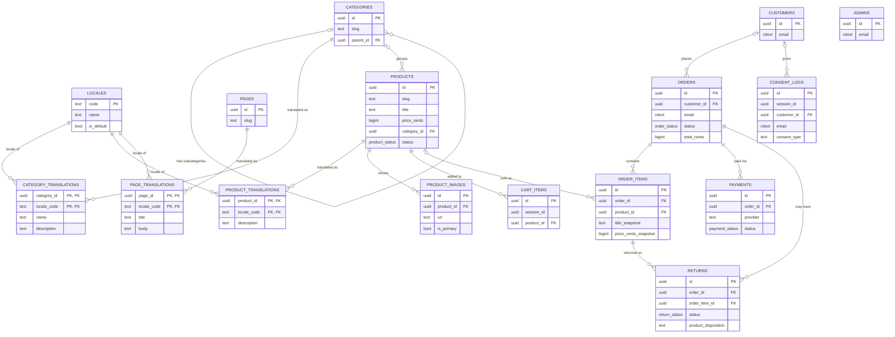

# enriplaso-art-web

A web application for an artist portfolio that can be converted into an art shop.

This README doubles as the planning document for the project. It describes what the site must do, derived from the data model in [art_shop_schema.sql](art_shop_schema.sql). Update it as decisions change — it should stay the source of truth for scope until a more formal spec exists.

## Vision

- The site launches as an **art portfolio/gallery**: showcase the artist's work, no purchasing.
- The **shop is an optional layer on top**, controlled by a feature flag. When it's off, the site behaves as a pure portfolio. When it's on, the same artwork listings become purchasable.
- Data model, routes, and UI should be built so the shop can be toggled without structural rework later — not bolted on as an afterthought.

## Tech stack

Decoupled frontend/backend, communicating over a REST/JSON API.

| Layer | Choice | Why |
|---|---|---|
| **Frontend** | **Next.js** (React) — frontend only, no Next API routes | Needed for SEO on the public gallery/artwork pages: SSG/ISR serves fully-rendered HTML to crawlers (important for search + social-share previews), unlike a plain client-rendered SPA. All data comes from the NestJS API rather than Next's own backend features. |
| **Backend** | **NestJS** (Node.js) | Structured, modular API (controllers/services/DI) — a good fit for the order/payment/admin logic in the schema. Runs as an independently deployable/scalable service from the frontend. |
| **Database** | **PostgreSQL 14+** (managed — e.g. Neon or Supabase) | Matches [art_shop_schema.sql](art_shop_schema.sql). Managed hosting avoids running/patching a DB server ourselves; a single shared instance is required once the app scales horizontally (see below). |
| **Image storage** | **Cloudflare R2** | See [Open questions](#open-questions) — cheap at this scale, free egress. |
| **Payments** | **Stripe** | See [Payments](#payments). |

Notes:
- Both Next.js and NestJS are stateless per-request (no in-memory session state), so either can be scaled horizontally behind a load balancer independently of the other. Cart/session state lives in the DB/cookies (`cart_items.session_id`), not in server memory, so any backend instance can serve any request.
- Being decoupled, CORS and API authentication (for the admin panel) need explicit setup between the two apps — this doesn't come for free the way it would in a single Next.js full-stack app.

### Project structure

An npm-workspaces monorepo — one `npm install` at the root installs both apps.

```
enriplaso-art-web/
├── art_shop_schema.sql        source-of-truth SQL DDL
├── apps/
│   ├── web/                   Next.js frontend (App Router, next-intl wired up)
│   │   ├── src/app/[locale]/  locale-prefixed routes (en default, es/de/fr)
│   │   ├── messages/          UI translation files, one per locale
│   │   └── src/middleware.ts  next-intl locale routing
│   └── api/                   NestJS backend
│       ├── src/               Nest modules/controllers/services
│       └── prisma/
│           ├── schema.prisma          typed client definition
│           └── migrations/0_init/     verbatim copy of art_shop_schema.sql
└── package.json                root workspace config
```

**Why Prisma's baseline migration is a copy of the SQL file, not generated from `schema.prisma`**: Prisma's schema language can't express everything in [art_shop_schema.sql](art_shop_schema.sql) — CHECK constraints, the two partial unique indexes (one default locale, one primary product image), and the `set_updated_at()` trigger. Rather than silently lose those, `apps/api/prisma/migrations/0_init/migration.sql` is byte-for-byte the same SQL file, and `schema.prisma` is hand-written to match it for the typed client. See the fidelity note at the top of `schema.prisma` for what to do when the schema changes.

**Getting started**:
```bash
npm install                          # installs both apps

# Backend — point DATABASE_URL (apps/api/.env, copy from .env.example) at a
# fresh Postgres database, then:
cd apps/api
npx prisma migrate deploy            # runs 0_init (the SQL file) against the DB
npx prisma generate                  # generate the typed client
npm run start:dev

# Frontend (separate terminal, from apps/web — copy .env.local.example to .env.local first)
npm run dev
```
Both `npm install`, `prisma generate`, and both apps' builds/lints have been verified to run clean as of this scaffold. `prisma migrate deploy`/`start:dev` still need a real Postgres instance to test against — nothing in this repo provisions one yet (see [Open questions](#open-questions)).

## Feature flag: `SHOP_ENABLED`

A single flag gates all shop functionality.

| State | Behavior |
|---|---|
| `SHOP_ENABLED = false` (default at launch) | Site shows gallery/portfolio only. No prices, "Add to cart", cart icon, checkout routes, or order-related UI anywhere. Artwork pages show image, title, medium, dimensions, description — no price or purchase action. |
| `SHOP_ENABLED = true` | Full shop surfaces: prices shown, cart, checkout, order confirmation, payment flow. |

Requirements for the flag:
- Must be checkable in **both apps**: NestJS (to reject shop endpoints — cart, checkout, orders — entirely, not just hide UI) and Next.js (to conditionally render shop UI/pages). A single source of truth (e.g. a config table or flag service both apps read) avoids the two getting out of sync.
- Toggling it must not require a data migration — `products`, `categories`, etc. exist and are populated regardless of flag state; the flag only controls whether purchase-related UI/endpoints are reachable.
- Disabling the shop after it's been live must not delete or corrupt orders/payments history — it only hides the buying flow going forward.
- Exact mechanism (env var, config table, LaunchDarkly-style service) is TBD — see [Open questions](#open-questions).

## Data model summary

Full definitions in [art_shop_schema.sql](art_shop_schema.sql). PostgreSQL 14+.

### Entity relationship diagram



Notes on the diagram:
- `|o` = zero-or-one, `||` = exactly one, `o{` = zero-or-many — matches each FK's actual nullability in [art_shop_schema.sql](art_shop_schema.sql) (e.g. `CATEGORIES |o--o{ PRODUCTS` reflects `products.category_id` being nullable — an artwork doesn't have to be categorized).
- `ADMINS` has no relationships to any other table — it's fully standalone, per the single-admin design.
- `cart_items.session_id` and `consent_logs.session_id` are plain UUIDs from a browser cookie, not foreign keys — there's no `sessions` table, so no relationship line for them.

- **admins** — single admin account (no roles/permissions layer needed).
- **locales** — supported languages (table, not an enum, so adding one is a row insert, not a migration). Seeded with English (default), Spanish, German, French.
- **categories** — hierarchical (self-referencing `parent_id`) for organizing artwork; `slug` is a single language-neutral URL segment.
- **category_translations** — per-locale `name`/`description` for each category (see [Internationalization](#internationalization-i18n)).
- **products** — the artworks (single-artist site — no `artist_name` column; artist bio/info lives site-wide, not per-product). Mostly one-of-a-kind (`is_unique = true`, capped at qty 1); supports editions/prints via `is_unique = false` with `quantity_available > 1`. Lifecycle: `draft → published → reserved → sold` / `archived`. `title` is a single fixed value (not translated).
- **product_translations** — per-locale `description` for each product.
- **product_images** — ordered gallery images per artwork, one flagged primary.
- **pages** / **page_translations** — editable, translated long-form content not tied to a product or category (About Me, Privacy Policy, Terms, Shipping & Returns). Same translation pattern as products/categories; admin-editable, no redeploy needed to change copy.
- **customers** — optional, keyed by email only, no login. Lets repeat buyers be recognized without an account system.
- **orders** — guest checkout by default (`customer_id` nullable); stores contact + shipping/billing address as JSONB snapshots.
- **order_items** — snapshots title/price at time of purchase so later edits to a product never rewrite order history.
- **returns** — one row per returned line item; tracks the admin workflow (`requested → approved/rejected → received → refunded`) and what happens to the physical piece afterward (`product_disposition`: relisted vs. archived as damaged). See [Returns](#returns).
- **payments** — records provider transactions (Stripe, PayPal, etc.) and status; never stores card data (see [Payments](#payments)).
- **cart_items** — guest, session-based (UUID cookie), no account required.
- **consent_logs** — append-only GDPR consent trail (cookie banner, newsletter opt-in, etc.), covering both anonymous sessions and known customers.

## Functional requirements

### Portfolio (always on)
- FR1: List published artworks in a gallery view, with images, title, medium, style, dimensions, year. Single-artist site — no per-artwork artist attribution needed; artist bio/info is a site-wide "About" page, not part of the product data.
- FR2: Artwork detail page per product.
- FR3: Browse/filter by category and tags. No search box planned at current catalog size (<200 pieces) — revisit if the catalog grows substantially.
- FR4: No price or purchase affordance visible while `SHOP_ENABLED = false`.

### Shop (gated by `SHOP_ENABLED`)
- FR5: Show price and availability (`status`, `quantity_available`) on artwork listing/detail when enabled.
- FR6: Add to cart (guest, session-cookie based); one cart per `session_id`.
- FR7: Checkout as guest — collect email, name, phone, shipping address (billing optional).
- FR8: Soft-reserve a unique item during checkout (`status = 'reserved'`, `reserved_until` timestamp) to prevent double-selling a one-of-a-kind piece.
- FR9: A scheduled job releases expired reservations (`reserved_until` passed, no completed payment) back to `published`.
- FR10: On successful payment: create `orders` + `order_items`, record `payments`, set product to `sold` (or decrement `quantity_available` for editions).
- FR11: Order confirmation page/email after purchase.
- FR12: Recognize a repeat buyer by email (optional `customers` row) without requiring login.

### Admin
- FR13: Single admin login (`admins` table — no multi-role permissions needed).
- FR14: CRUD for categories, products, and product images (manage drafts before publishing).
- FR15: View/manage orders and their status (`pending → paid → processing → shipped → delivered`, or `cancelled` / `refunded`).
- FR16: Toggle `SHOP_ENABLED` (admin-facing control, if the flag mechanism supports runtime toggling rather than a deploy-time env var).

### Compliance / consent
- FR17: Log cookie-consent and marketing-consent choices (given/withdrawn) with method and policy version, per `consent_logs`.
- FR18: Compute current consent state per subject as the latest `consent_logs` row for that (subject, consent_type) pair.

### Internationalization
- FR19: Serve the site in multiple languages, seeded with English (default), Spanish, German, French — extensible without a migration (see [Internationalization](#internationalization-i18n)).
- FR20: Admin can add/manage a product's and category's translated content per locale (extends FR14).
- FR21: Admin can create/edit translated static pages (About Me, Privacy Policy, Terms, Shipping & Returns) per locale, without a code change or redeploy.

### Admin notifications
- FR22: Admin is notified by email and by a Telegram message when a product sells (see [Admin notifications](#admin-notifications)).

### Returns
- FR23: Buyer can request a return on a delivered order item within the statutory window (see [Returns](#returns)).
- FR24: Admin can approve/reject a return request, mark it received, and record the physical item's disposition (relisted vs. archived as damaged).
- FR25: Approving a return issues a refund via the payment provider and updates `payments.status` (`refunded`/`partially_refunded`) and `orders.status` (`refunded`) accordingly.
- FR26: A relisted returned item goes back to `products.status = 'published'`; a damaged one goes to `'archived'` rather than being resold.

## Payments

- **No card data is ever stored in this database.** The `payments` table only stores `provider`, `provider_transaction_id`, `amount_cents`, `status`, and the provider's `raw_response` — never PAN/CVV.
- Use a PCI-compliant third-party processor (e.g. **Stripe**, with PayPal or Mollie as alternatives) for actual card handling. The processor's client-side SDK tokenizes card details directly with the provider; they never transit our server.
- Payment confirmation is driven by the provider's webhook (e.g. Stripe `payment_intent.succeeded`), which then updates `orders.status` and `products.status`.
- Rationale: avoids PCI-DSS Level 1 scope (audits, network segmentation) that would be disproportionate for a single-admin shop.

## Returns

- **Legal context**: since pricing defaults to EUR (likely EU buyers), online consumer sales are generally subject to a **14-day statutory right of withdrawal** under EU consumer protection law. A pre-existing original artwork does not qualify for the "custom/personalized goods" exemption (that only covers genuine made-to-order commissions) — so returns support isn't just a nice-to-have.
- **Why a dedicated `returns` table** rather than reusing `orders.status`: an order can contain multiple `order_items` (e.g. a multi-piece edition purchase), and each item may be returned independently, approved/rejected on its own timeline, and — since most items are one-of-a-kind — needs its own record of what happened to the physical piece afterward.
- **Flow**: buyer requests a return (FR23) → admin reviews and approves/rejects (FR24) → if approved, buyer ships the item back → admin marks it `received` and records `product_disposition` (`relisted` if undamaged and sellable, `archived_damaged` if not) → admin triggers the refund, which calls the payment provider's refund API and records `provider_refund_id`/`refund_amount_cents` on the `returns` row, and updates `payments`/`orders` status (FR25).
- Like the sale-confirmation flow, refund processing goes through the **payment provider's API** (e.g. Stripe Refunds) — the app never has to touch card data to reverse a charge either.

## Admin notifications

When a sale completes (the point where `orders.status → 'paid'` and `products.status → 'sold'`, per FR10), the admin is notified through two channels:

- **Email** — via the same provider used for buyer order-confirmation emails (provider TBD, see [Open questions](#open-questions)), sent to `admins.email`.
- **Telegram** — a message sent via a Telegram bot to the admin's personal chat, so it lands as a normal phone notification without building a native push stack.

Design notes:
- **No database change is needed for this.** The bot token and the admin's chat ID are configuration (environment variables), not data — there's a single admin, so there's nothing to look up per-user.
- Dispatch happens from **application code** (the NestJS webhook handler), not a Postgres trigger — triggers can't reliably make outbound HTTP calls to Telegram's/the email provider's API.
- Notification sending should not block or fail the payment webhook itself: if Telegram/email is briefly down, the sale must still be recorded correctly; the notification call should be fire-and-forget (or queued/retried) rather than part of the same transaction as the order/payment writes.
- This scales to more triggers later (e.g. "low stock," "new consent withdrawal") without new tables — just more call sites hitting the same notification service.

## Internationalization (i18n)

Three separate concerns, each handled in a different layer:

| What | Where | How |
|---|---|---|
| Static UI text (buttons, nav, form labels, errors) | Next.js frontend | `next-intl` (or `next-i18next`) with per-locale JSON translation files. No DB involvement — these change rarely and are a developer edit, not an admin one. |
| Editorial content (product `description`, category `name`/`description`) | Database | `product_translations` / `category_translations` tables, one row per `(entity, locale)`. Product `title` and category `slug` stay single-valued — not translated. |
| Long-form static pages (About Me, Privacy Policy, Terms, Shipping & Returns) | Database | `pages` / `page_translations` tables, same one-row-per-`(page, locale)` pattern. Admin-editable from the admin panel — no redeploy needed to fix a typo or update a policy. |
| Locale-aware formatting (currency, dates) | Next.js frontend | `Intl.NumberFormat` / `Intl.DateTimeFormat`, formatting the existing `price_cents`/`currency`/timestamp values per the visitor's locale — no new data needed. |

Other requirements:
- Locales are data (`locales` table), not a hardcoded list — adding a language is an admin INSERT, not a deploy. Seeded at launch with English (`is_default`), Spanish, German, French.
- If a translation row is missing for the visitor's locale, the app falls back to the default locale (`locales.is_default`) — the schema doesn't enforce that every locale has a row for every product/category/page.
- URL routing is locale-prefixed (e.g. `/en/gallery`, `/es/galeria`) via Next.js's i18n routing, with `hreflang` tags linking the locale variants of a page together — needed since SEO is a priority for the public gallery (see [Tech stack](#tech-stack)).

## Non-functional requirements

- NFR1: Currency defaults to EUR (`CHAR(3)`), but schema supports other ISO currency codes per product/order.
- NFR2: Editing or deleting a product must never alter historical order records (`order_items` snapshots enforce this).
- NFR3: GDPR consent must be provable after the fact — append-only log, not a mutable flag.
- NFR4: No customer password storage; guest checkout only, minimizing account-security surface area.
- NFR5: A missing translation must degrade to the default locale, never to a blank/broken page.

## Open questions

- [x] Frontend/backend stack — **Next.js (frontend) + NestJS (backend)**, decoupled. Hosting TBD.
- [ ] Feature flag mechanism: simple env var vs. a flag admins can toggle at runtime from a settings UI.
- [ ] Which payment provider(s) to integrate first — Stripe assumed as default, confirm.
- [ ] Shipping cost calculation: flat rate, per-item, or carrier API integration?
- [ ] Tax handling (EU VAT / OSS) — manual entry vs. automated (e.g. Stripe Tax).
- [ ] Email delivery for order confirmations — provider TBD.
- [x] Image hosting/CDN for `product_images.url` — leaning towards **Cloudflare R2** (cheap at this scale, free egress, so bandwidth to gallery visitors doesn't add cost as traffic grows). Not finalized.
- [x] Multi-language support — translation tables for `products`/`categories` content, `next-intl` for UI strings, seeded with English/Spanish/German/French, extensible via the `locales` table.
- [x] Admin sale notifications — email + **Telegram bot**, no DB change (see [Admin notifications](#admin-notifications)). Still need to: create the Telegram bot and get its token, and pick the email provider (shared with order confirmations, above).
- [ ] Return window length — default to the EU statutory 14 days, or set something longer as a goodwill policy?
- [ ] Who pays return shipping — buyer or seller — and is that conditional on the return reason (damaged/wrong item vs. simple change of mind)?
- [ ] Restocking/condition-check process — how is a returned original inspected before being relisted (`product_disposition = 'relisted'`)?

## License

See [LICENSE](LICENSE).
