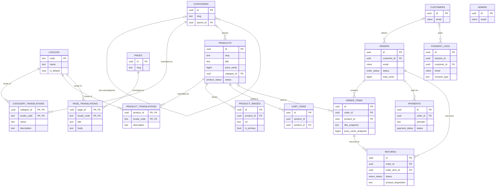

# enriplaso-art-web

A web application for an artist portfolio that can be converted into an art shop.

This README doubles as the planning document for the project. It describes what the site must do, derived from the data model in [art_shop_schema.sql](art_shop_schema.sql). Update it as decisions change — it should stay the source of truth for scope until a more formal spec exists.

## Vision

- The site launches as an **art portfolio/gallery**: showcase the artist's work, no purchasing.
- The **shop is an optional layer on top**, controlled by a feature flag. When it's off, the site behaves as a pure portfolio. When it's on, the same artwork listings become purchasable.
- Data model, routes, and UI should be built so the shop can be toggled without structural rework later — not bolted on as an afterthought.

## Tech stack

Decoupled frontend/backend, communicating over a REST/JSON API.

| Layer | Choice | Why |
|---|---|---|
| **Frontend** | **Next.js** (React) — frontend only, no Next API routes | Needed for SEO on the public gallery/artwork pages: SSG/ISR serves fully-rendered HTML to crawlers (important for search + social-share previews), unlike a plain client-rendered SPA. All data comes from the NestJS API rather than Next's own backend features. |
| **Backend** | **NestJS** (Node.js) | Structured, modular API (controllers/services/DI) — a good fit for the order/payment/admin logic in the schema. Runs as an independently deployable/scalable service from the frontend. |
| **Database** | **PostgreSQL 14+** (managed — e.g. Neon or Supabase) | Matches [art_shop_schema.sql](art_shop_schema.sql). Managed hosting avoids running/patching a DB server ourselves; a single shared instance is required once the app scales horizontally (see below). |
| **Image storage** | **S3-compatible** (Cloudflare R2 in prod, MinIO locally) | See [Image storage](#image-storage) — provider-agnostic client, free egress on R2. |
| **Payments** | **Stripe** | See [Payments](#payments). |

Notes:
- Both Next.js and NestJS are stateless per-request (no in-memory session state), so either can be scaled horizontally behind a load balancer independently of the other. Cart/session state lives in the DB/cookies (`cart_items.session_id`), not in server memory, so any backend instance can serve any request.
- Being decoupled, CORS and API authentication (for the admin panel) need explicit setup between the two apps — this doesn't come for free the way it would in a single Next.js full-stack app.

### Project structure

An npm-workspaces monorepo — one `npm install` at the root installs both apps.

```
enriplaso-art-web/
├── art_shop_schema.sql        source-of-truth SQL DDL
├── apps/
│   ├── web/                   Next.js frontend (App Router, next-intl wired up)
│   │   ├── src/app/[locale]/  locale-prefixed routes (en default, es/de/fr)
│   │   ├── messages/          UI translation files, one per locale
│   │   └── src/middleware.ts  next-intl locale routing
│   └── api/                   NestJS backend
│       ├── src/               Nest modules/controllers/services
│       └── prisma/
│           ├── schema.prisma          typed client definition
│           └── migrations/0_init/     verbatim copy of art_shop_schema.sql
└── package.json                root workspace config
```

**Why Prisma's baseline migration is a copy of the SQL file, not generated from `schema.prisma`**: Prisma's schema language can't express everything in [art_shop_schema.sql](art_shop_schema.sql) — CHECK constraints, the two partial unique indexes (one default locale, one primary product image), and the `set_updated_at()` trigger. Rather than silently lose those, `apps/api/prisma/migrations/0_init/migration.sql` is byte-for-byte the same SQL file, and `schema.prisma` is hand-written to match it for the typed client. See the fidelity note at the top of `schema.prisma` for what to do when the schema changes.

**Getting started**:
```bash
npm install                          # installs both apps

docker compose up -d                 # local Postgres for development (see docker-compose.yml)

# Backend
cd apps/api
copy .env.example .env               # DATABASE_URL already matches docker-compose.yml's credentials; set JWT_SECRET too
npx prisma migrate deploy            # runs 0_init (the SQL file) against the DB
npx prisma generate                  # generate the typed client
SEED_ADMIN_EMAIL=you@example.com SEED_ADMIN_PASSWORD=choose-one npm run prisma:seed  # creates the one admin account
npm run start:dev

# Frontend (separate terminal, from apps/web — copy .env.local.example to .env.local first)
npm run dev
```
`docker-compose.yml` at the repo root runs a single `postgres:16-alpine` container for local development only — it is not a production database setup (see [Open questions](#open-questions) for managed hosting). `npm install`, `prisma generate`, both apps' builds/lints/tests, and the full auth + health-check flow have all been verified against a real running server and database as of this scaffold.

### Backend architecture

`apps/api` follows a **layered architecture**, organized as NestJS feature modules (one per domain area — `ProductsModule`, `OrdersModule`, `PaymentsModule`, `ReturnsModule`, `PagesModule`, `AdminModule`, etc.), each with the same three layers:

| Layer | Responsibility | Example |
|---|---|---|
| **Controller** | HTTP only — routes, request/response shape, DTO validation (`class-validator`). No business logic. | `OrdersController` exposes `POST /orders`, delegates immediately to the service. |
| **Service** | Business logic and workflow. This is where the actual rules from the Functional requirements live. | `OrdersService` implements the reserve → pay → sold flow (FR8–FR11); `ReturnsService` implements the return workflow (FR23–FR26). |
| **Persistence** | `PrismaService` (see [prisma.module.ts](apps/api/src/prisma/prisma.module.ts)) — injected into services, not into controllers. | `this.prisma.order.create({ ... })`. |

**No separate composition root is needed.** NestJS's own module system already fills that role: `NestFactory.create(AppModule)` in [main.ts](apps/api/src/main.ts), combined with `@Module()`/`@Injectable()` decorators and constructor injection, *is* the composition root — it wires every service to its dependencies (like `PrismaService`) through Nest's built-in IoC container. Hand-rolling a second, manual composition root on top would just duplicate what Nest already does declaratively, and would mean working against the framework rather than with it. The one scenario where that tradeoff would flip is if the business logic needed to be fully framework-agnostic (portable outside Nest entirely) — not a requirement here for a single-admin shop.

**No separate DAO/repository layer either** — `PrismaService`'s generated, typed query methods (`prisma.product.findMany()`, etc.) already are the data-access layer; wrapping them in another pass-through class per model would add a layer with no behavior of its own. Services call `PrismaService` directly — see [prisma.service.ts](apps/api/src/prisma/prisma.service.ts) for how the client's lifecycle (connect/disconnect) is hooked into Nest's module lifecycle. The one exception is raw SQL for things Prisma's DSL can't express (e.g. the consent-state `DISTINCT ON` query) — always via `$queryRaw`'s tagged-template syntax (auto-parameterized, safe), never `$queryRawUnsafe` with a manually built string.

### Health checks

`HealthModule` ([health.controller.ts](apps/api/src/health/health.controller.ts), via `@nestjs/terminus`) exposes two intentionally different endpoints — conflating them is a common mistake that causes an app to restart-loop during a database outage instead of recovering on its own:

| Endpoint | Checks | Meaning | On failure |
|---|---|---|---|
| `GET /health` | Nothing — process only | **Liveness**: is this process alive? | Orchestrator (Docker/k8s) **restarts the container**. Must never depend on external services — restarting the API doesn't fix a Postgres outage, it just crash-loops the API while the real problem is elsewhere. |
| `GET /health/ready` | Postgres, via `PrismaHealthIndicator.pingCheck()` | **Readiness**: should traffic be routed here right now? | Orchestrator **stops routing traffic** here, but leaves the process running. It recovers automatically — no restart — the moment Postgres is reachable again. |

Verified by hand: stopping the `db` container makes `/health/ready` return `503` while `/health` stays `200`; restarting `db` brings `/health/ready` back to `200` on its own, with no app restart at any point. When this gets containerized, wire a Dockerfile `HEALTHCHECK` / Kubernetes `livenessProbe` to `/health` and a `readinessProbe` to `/health/ready` — never the reverse.

### Admin authentication

`AuthModule` ([auth.module.ts](apps/api/src/auth/auth.module.ts)) protects every admin-only write endpoint (currently `POST`/`PATCH`/`DELETE /products`, via `@UseGuards(AdminAuthGuard)`; every future admin action follows the same pattern).

- **Login** (`POST /auth/login`): looks up `admins` by email, compares the password against `password_hash` with **bcrypt**, and on success signs a JWT and sets it as an **httpOnly, Secure (in production), SameSite=Lax cookie** — never returned in the response body, so it's unreachable from JavaScript (XSS-proof) and safe for the decoupled Next.js frontend to use via `credentials: 'include'` (CORS already allows credentials, per [Tech stack](#tech-stack)).
- **`AdminAuthGuard`** reads that cookie, verifies the JWT via `@nestjs/jwt`, and attaches the admin to the request. It's a plain `CanActivate` guard, not Passport — Passport's strategy-swapping (OAuth, multiple providers) isn't a problem this single hardcoded admin account has.
- **No refresh-token rotation** — a longer-lived token (7 days) plus a working `POST /auth/logout` is enough for one low-traffic admin; refresh tokens solve a multi-user/high-security problem this app doesn't have.
- **Bootstrapping**: there's no signup flow by design. The first (and likely only) admin is created via `npm run prisma:seed` ([seed.ts](apps/api/prisma/seed.ts)), reading `SEED_ADMIN_EMAIL`/`SEED_ADMIN_PASSWORD` from the environment and hashing the password with bcrypt — never commit real credentials, only ever pass them inline when running the seed.

**A NestJS DI gotcha worth knowing if this pattern gets copied**: `@UseGuards(SomeGuard)` resolves the guard from the *consuming* module's injector, not the module where the guard is declared. Exporting `AdminAuthGuard` from `AuthModule` wasn't enough on its own — `ProductsModule` also needed `JwtModule` (the guard's own dependency) re-exported through `AuthModule`, or booting the real app failed with a `Nest can't resolve dependencies` error despite the guard's unit tests passing fine (unit tests call controller methods directly, bypassing the guard pipeline entirely, so they never exercised this).

**Another gap this surfaced**: building the app via `Test.createTestingModule(...).createNestApplication()` (what every e2e test does) never runs `main.ts`'s `bootstrap()` — so `cookie-parser`, CORS, and the global `ValidationPipe` were silently absent from every e2e test until they were extracted into a shared [configure-app.ts](apps/api/src/configure-app.ts) called from both `main.ts` and each e2e test's setup. Without that fix, the login e2e test looked like it worked (login itself doesn't need cookies to be *read*) but every subsequent authenticated request silently failed, since `request.cookies` was always `undefined`.

Full login → protected-route → logout → re-blocked flow verified by hand against the real running server and database (not just the automated tests) — see [auth.e2e-spec.ts](apps/api/test/e2e/auth.e2e-spec.ts) for the equivalent automated coverage.

#### Two-factor authentication (TOTP)

Optional per-admin, on top of the password. Uses standard TOTP (RFC 6238) — works with any compatible authenticator app (Google Authenticator, Authy, 1Password, **Okta Verify**, etc.); nothing app-specific to build, since it's an open standard.

- **`admins`** gained `totp_secret`, `totp_enabled`, and `backup_codes` (bcrypt-hashed, one-time recovery codes — critical for a single-admin site, since there's no "contact support" path if the authenticator device is lost). These columns are folded directly into the `0_init` baseline in both [art_shop_schema.sql](art_shop_schema.sql) and the matching Prisma migration, rather than added as a separate migration — while the project is still pre-production and the dev DB is disposable (a Docker container), there's no history worth preserving yet, and a real `prisma migrate dev` diff against the hand-authored baseline renames indexes/FKs to Prisma's own default naming as a side effect, which is noise worth avoiding while it's still free to avoid. Once this ships anywhere with real data, schema changes go back to normal `prisma migrate dev` migrations — see the fidelity note in [schema.prisma](apps/api/prisma/schema.prisma).
- **Enrollment** (requires an existing full session): `POST /auth/2fa/setup` generates a secret and returns a QR code (`otplib` + `qrcode`) — stored but *not yet enabled*. `POST /auth/2fa/confirm` requires the admin to submit a real code from their app, proving they scanned it correctly, before `totp_enabled` flips to `true` and backup codes are generated and returned once (only their bcrypt hashes are ever persisted). `POST /auth/2fa/disable` turns it back off.
- **Login becomes two-step once enabled**: `POST /auth/login` with a correct password no longer sets the real session cookie — it sets a separate, short-lived (5 min) `pending_2fa_token` cookie and returns `{ requiresTwoFactor: true }`. `POST /auth/2fa/verify` exchanges a valid TOTP code (or an unused backup code) for the real `access_token` session cookie.
- **The pending token is deliberately not just "a cookie with a different name"** — `AdminAuthGuard` explicitly rejects any token carrying a `purpose: 'pending_2fa'` claim, so even if that token ended up under the `access_token` cookie name somehow, it still could not grant a session. Cookie separation is a UX convenience here, not the actual security boundary.
- **Okta note**: Okta Verify works as the authenticator app for free, today, with zero extra code — TOTP is a standard, and Okta Verify supports adding third-party accounts via the same QR-code flow as any other authenticator. Making Okta the *identity provider* (full OIDC/OAuth2 login delegation) was considered and rejected as disproportionate for a single admin account — that's a paid enterprise SSO product priced and designed for organizations managing many users across many apps.

Full flow verified by hand against the real server, database, and real generated TOTP codes: enroll → confirm → next login pauses at `requiresTwoFactor` → pending cookie alone correctly rejected by `/auth/me` → wrong code rejected → correct code completes login → backup code works as an alternative → a used backup code is correctly rejected on reuse → disable restores password-only login. Automated as an e2e test in [auth.e2e-spec.ts](apps/api/test/e2e/auth.e2e-spec.ts) using `otplib` to generate real codes rather than mocking time/crypto.

#### Rate limiting

Two independent layers, because they defend against different things — one doesn't make the other redundant, including once nginx (or another edge proxy) sits in front of this in production:

| Layer | Scope | Catches | Doesn't catch |
|---|---|---|---|
| **`@nestjs/throttler`** (`ThrottlerGuard`, global default 100 req/min/IP; `10 req/min/IP` on `/auth/login` and `/auth/2fa/verify` specifically) | Per IP address | Generic volumetric abuse from one source | An attacker spreading requests across many IPs (proxies, botnets) targeting the *same* admin account — IP-based limiting has no concept of "account," only "source address," and a shared IP (corporate NAT, mobile carrier) can wrongly throttle unrelated legitimate users |
| **Account lockout** (`admins.failed_login_attempts`/`locked_until`, in `AuthService`) | Per admin account | The actual threat that matters for a single-admin site: guessing *this* account's password or TOTP code, regardless of source IP | Generic request flooding unrelated to a specific account (that's the throttler's job) |

Design details:
- The failure counter is shared across **both** the password step and the 2FA-code step, and only resets to zero when a login fully completes. Resetting it after a successful password check (before 2FA) would let an attacker who already has the password get unlimited tries at the 2FA code, since each of their password attempts would count as "successful."
- Locking checks happen **before** comparing the password/code, not after — otherwise the lockout would only ever apply retroactively to the attempt that triggered it, not to the ones that should be blocked by it.
- 5 failed attempts → 15-minute lock (`MAX_FAILED_LOGIN_ATTEMPTS`/`LOCKOUT_DURATION_MS` in [auth.constants.ts](apps/api/src/auth/auth.constants.ts)). A lock that has simply timed out doesn't need an explicit "unlock" step — the timestamp comparison naturally stops blocking once it's passed.
- Verified by hand against the real server/database: baseline login works → 5 wrong passwords → the 6th attempt is rejected (`429`) **even with the correct password**, proving the lock protects the account, not just wrong guesses → manually expiring the lock in the database lets login succeed again and resets the counter to zero. The IP throttle was verified separately: exactly the first 10 requests to `/auth/login` in a 60-second window succeed, the 11th gets `429`.
- The two mechanisms needed to be tested in isolation from each other in [auth.e2e-spec.ts](apps/api/test/e2e/auth.e2e-spec.ts)/[rate-limit.e2e-spec.ts](apps/api/test/e2e/rate-limit.e2e-spec.ts): both are IP+time-window-scoped in-memory state tied to one Nest application instance, so a test suite making many `/auth/login` calls for unrelated reasons (2FA flow tests, lockout tests) can accidentally trip the *other* mechanism and produce a `429` that's misattributed to the wrong cause. `Test.createTestingModule(...).overrideGuard(ThrottlerGuard)` does **not** work for this — a guard registered globally via `APP_GUARD` isn't intercepted by `overrideGuard`, which only overrides guards resolved through `@UseGuards()` metadata. The reliable fix was giving throttling-sensitive test groups their own fresh app instance instead, each starting with an empty counter.

## Feature flag: `SHOP_ENABLED`

A single flag gates all shop functionality.

| State | Behavior |
|---|---|
| `SHOP_ENABLED = false` (default at launch) | Site shows gallery/portfolio only. No prices, "Add to cart", cart icon, checkout routes, or order-related UI anywhere. Artwork pages show image, title, medium, dimensions, description — no price or purchase action. |
| `SHOP_ENABLED = true` | Full shop surfaces: prices shown, cart, checkout, order confirmation, payment flow. |

Requirements for the flag:
- Must be checkable in **both apps**: NestJS (to reject shop endpoints — cart, checkout, orders — entirely, not just hide UI) and Next.js (to conditionally render shop UI/pages). A single source of truth (e.g. a config table or flag service both apps read) avoids the two getting out of sync.
- Toggling it must not require a data migration — `products`, `categories`, etc. exist and are populated regardless of flag state; the flag only controls whether purchase-related UI/endpoints are reachable.
- Disabling the shop after it's been live must not delete or corrupt orders/payments history — it only hides the buying flow going forward.
- Exact mechanism (env var, config table, LaunchDarkly-style service) is TBD — see [Open questions](#open-questions).

## Data model summary

Full definitions in [art_shop_schema.sql](art_shop_schema.sql). PostgreSQL 14+.

### Entity relationship diagram



Notes on the diagram:
- `|o` = zero-or-one, `||` = exactly one, `o{` = zero-or-many — matches each FK's actual nullability in [art_shop_schema.sql](art_shop_schema.sql) (e.g. `CATEGORIES |o--o{ PRODUCTS` reflects `products.category_id` being nullable — an artwork doesn't have to be categorized).
- `ADMINS` has no relationships to any other table — it's fully standalone, per the single-admin design.
- `cart_items.session_id` and `consent_logs.session_id` are plain UUIDs from a browser cookie, not foreign keys — there's no `sessions` table, so no relationship line for them.

- **admins** — single admin account (no roles/permissions layer needed).
- **locales** — supported languages (table, not an enum, so adding one is a row insert, not a migration). Seeded with English (default), Spanish, German, French.
- **categories** — hierarchical (self-referencing `parent_id`) for organizing artwork; `slug` is a single language-neutral URL segment.
- **category_translations** — per-locale `name`/`description` for each category (see [Internationalization](#internationalization-i18n)).
- **products** — the artworks (single-artist site — no `artist_name` column; artist bio/info lives site-wide, not per-product). Mostly one-of-a-kind (`is_unique = true`, capped at qty 1); supports editions/prints via `is_unique = false` with `quantity_available > 1`. Lifecycle: `draft → published → reserved → sold` / `archived`. `title` is a single fixed value (not translated).
- **product_translations** — per-locale `description` for each product.
- **product_images** — ordered gallery images per artwork, one flagged primary.
- **pages** / **page_translations** — editable, translated long-form content not tied to a product or category (About Me, Privacy Policy, Terms, Shipping & Returns). Same translation pattern as products/categories; admin-editable, no redeploy needed to change copy.
- **customers** — optional, keyed by email only, no login. Lets repeat buyers be recognized without an account system.
- **orders** — guest checkout by default (`customer_id` nullable); stores contact + shipping/billing address as JSONB snapshots.
- **order_items** — snapshots title/price at time of purchase so later edits to a product never rewrite order history.
- **returns** — one row per returned line item; tracks the admin workflow (`requested → approved/rejected → received → refunded`) and what happens to the physical piece afterward (`product_disposition`: relisted vs. archived as damaged). See [Returns](#returns).
- **payments** — records provider transactions (Stripe, PayPal, etc.) and status; never stores card data (see [Payments](#payments)).
- **cart_items** — guest, session-based (UUID cookie), no account required.
- **consent_logs** — append-only GDPR consent trail (cookie banner, newsletter opt-in, etc.), covering both anonymous sessions and known customers.

## Functional requirements

### Portfolio (always on)
- FR1: List published artworks in a gallery view, with images, title, medium, style, dimensions, year. Single-artist site — no per-artwork artist attribution needed; artist bio/info is a site-wide "About" page, not part of the product data.
- FR2: Artwork detail page per product.
- FR3: Browse/filter by category and tags, plus keyword search (`?search=`) across title, medium, style, and description. Implemented — see [Search](#search).
- FR4: No price or purchase affordance visible while `SHOP_ENABLED = false`.

### Shop (gated by `SHOP_ENABLED`)
- FR5: Show price and availability (`status`, `quantity_available`) on artwork listing/detail when enabled.
- FR6: Add to cart (guest, session-cookie based); one cart per `session_id`.
- FR7: Checkout as guest — collect email, name, phone, shipping address (billing optional).
- FR8: Soft-reserve a unique item during checkout (`status = 'reserved'`, `reserved_until` timestamp) to prevent double-selling a one-of-a-kind piece.
- FR9: A scheduled job releases expired reservations (`reserved_until` passed, no completed payment) back to `published`.
- FR10: On successful payment: create `orders` + `order_items`, record `payments`, set product to `sold` (or decrement `quantity_available` for editions).
- FR11: Order confirmation page/email after purchase.
- FR12: Recognize a repeat buyer by email (optional `customers` row) without requiring login.

### Admin
- FR13: Single admin login (`admins` table — no multi-role permissions needed). Implemented — see [Admin authentication](#admin-authentication).
- FR14: CRUD for categories, products, and product images (manage drafts before publishing). Implemented — see [Image storage](#image-storage) for upload/delete. Categories: a new category must include a default-locale translation (so the fallback always has a name to show); moving a category under itself or one of its own descendants is rejected; deleting a category leaves its products and subcategories in place, with no category / at the top level (`ON DELETE SET NULL`), verified against the real database in [categories.e2e-spec.ts](apps/api/test/e2e/categories.e2e-spec.ts).
- FR15: View/manage orders and their status (`pending → paid → processing → shipped → delivered`, or `cancelled` / `refunded`).
- FR16: Toggle `SHOP_ENABLED` (admin-facing control, if the flag mechanism supports runtime toggling rather than a deploy-time env var).

### Compliance / consent
- FR17: Log cookie-consent and marketing-consent choices (given/withdrawn) with method and policy version, per `consent_logs`.
- FR18: Compute current consent state per subject as the latest `consent_logs` row for that (subject, consent_type) pair.

### Internationalization
- FR19: Serve the site in multiple languages, seeded with English (default), Spanish, German, French — extensible without a migration (see [Internationalization](#internationalization-i18n)).
- FR20: Admin can add/manage a product's and category's translated content per locale (extends FR14).
- FR21: Admin can create/edit translated static pages (About Me, Privacy Policy, Terms, Shipping & Returns) per locale, without a code change or redeploy.

### Admin notifications
- FR22: Admin is notified by email and by a Telegram message when a product sells (see [Admin notifications](#admin-notifications)).

### Returns
- FR23: Buyer can request a return on a delivered order item within the statutory window (see [Returns](#returns)).
- FR24: Admin can approve/reject a return request, mark it received, and record the physical item's disposition (relisted vs. archived as damaged).
- FR25: Approving a return issues a refund via the payment provider and updates `payments.status` (`refunded`/`partially_refunded`) and `orders.status` (`refunded`) accordingly.
- FR26: A relisted returned item goes back to `products.status = 'published'`; a damaged one goes to `'archived'` rather than being resold.

## Search

`GET /products?search=` matches against `products.title`, `products.medium`, `products.style`, and the *current-locale* `product_translations.description` — see [products.service.ts](apps/api/src/products/products.service.ts). Draft/archived products never match, same as every other `findPublished` filter.

This started as plain, case-insensitive substring matching (`ILIKE`) — the right amount of complexity for a catalog this small, since a sequential scan on a few hundred rows is low-single-digit milliseconds regardless of indexing. It's since been upgraded to also tolerate typos, via **pg_trgm**, once there was an actual reason to (this reverses an even earlier decision — `pg_trgm` had been removed from the schema entirely for being unneeded at a single-artist site's scale).

**How the fuzzy matching actually works** — and a real wrong turn worth documenting, not glossing over:

- Every candidate is checked against **both** a plain `ILIKE` substring match **and** `pg_trgm`'s `word_similarity()`, combined with `OR`. Both are needed: `ILIKE` still catches exact/short-term matches that trigram similarity handles weakly (a 3-character term like "cat" has very few trigrams to compare), while `word_similarity()` adds tolerance for actual misspellings.
- The first implementation used plain `similarity()` (whole-field comparison) with the standard `%` operator — the same thing most `pg_trgm` examples show. Checking it against the real database *before* committing to it surfaced a real problem: `similarity('Golden Sunset Hour', 'sunst')` scores only ≈0.19, **below** the 0.3 default match threshold, because `similarity()` compares the entire field against the entire search term, and a short typo'd word gets diluted once the field is longer than a couple of words. So a typo in a real (multi-word) title would have silently failed to match.
- The fix was switching to **`word_similarity()`** (and its `<%` operator) instead, which finds the best-matching word-length substring within the longer field rather than comparing whole strings — `word_similarity('sunst', 'Golden Sunset Hour')` scores ≈0.67, comfortably above threshold. Verified directly against Postgres for both the failing and working versions before writing any application code, not assumed from how `pg_trgm` examples are usually written.
- Trigram indexes (`gin_trgm_ops`) on `products.title`/`medium`/`style` and `product_translations.description` back this — see [art_shop_schema.sql](art_shop_schema.sql). Prisma's `@@index` can't express a custom GIN operator class, so, like the CHECK constraints and partial unique indexes noted in [schema.prisma](apps/api/prisma/schema.prisma)'s fidelity note, these live in the SQL migration only.
- **Query shape**: Prisma has no `pg_trgm` operators in its query DSL, so this is implemented as raw SQL (`$queryRaw`, always the safe tagged-template form — see [Backend architecture](#backend-architecture)), but only for the relevance ranking. The structural filters (`status`/`categorySlug`/`tag`) still go through the same Prisma `where` object as the non-search path — first as a query for candidate IDs, then the raw SQL ranks and filters just those candidates by relevance, then a final `findMany` re-fetches the matching page with its relations (translations/images/category) included. This avoids re-implementing the category/tag filtering logic twice. The candidate set is this catalog's whole scale, so pagination happens by slicing the ranked list in JS rather than pushing `OFFSET`/`LIMIT` into the raw query.
- **A second real bug** the e2e run (not the manual `psql` check) caught: `p.id IN (${Prisma.join(candidateIds)})` failed with `operator does not exist: uuid = text`, since Prisma interpolates the candidate IDs as `text` parameters against a `uuid` column. Fixed with an explicit `p.id::text IN (...)` cast. This is exactly why the manual verification against a literal SQL subquery wasn't sufficient on its own — Prisma's actual parameter binding behaves differently, and only running it through the real code path caught it.

Verified against the real database in [products-search.e2e-spec.ts](apps/api/test/e2e/products-search.e2e-spec.ts): case-insensitive substring matching on title/medium/style/description independently, a British/American spelling variant with **no shared substring at all** (`watercolour` finding `Watercolor`), a misspelled word found *inside* a longer title (`sunst` finding "Golden Sunset Hour" — the exact case that broke with plain `similarity()`), and that draft products never appear regardless of match.

## Image storage

Product photos are stored in an S3-compatible object store, not the database — `product_images.url` is just a public URL pointing at the object. See [storage.service.interface.ts](apps/api/src/storage/storage.service.interface.ts), [s3-storage.service.ts](apps/api/src/storage/s3-storage.service.ts), and the upload/delete endpoints on [products.controller.ts](apps/api/src/products/products.controller.ts).

**Provider-agnostic by construction, not by abstraction layers.** Cloudflare R2, Backblaze B2, AWS S3, and MinIO (used for local dev/e2e) all implement the same S3 API, so a single `S3StorageService` — built on `@aws-sdk/client-s3` — covers all of them. Switching provider is an env var change (`STORAGE_ENDPOINT`/`STORAGE_REGION`/credentials), not a code change. `ProductsService` depends on a narrow `StorageService` interface (`uploadPublicObject`/`deleteObjectByUrl`), not the SDK directly — that seam is what keeps unit tests able to mock storage entirely, and leaves room for a genuinely different backend later without touching `ProductsService`. A per-provider adapter class would just duplicate `S3StorageService` for no behavioral difference, since the providers don't actually differ at the protocol level.

**Local dev / e2e**: `docker compose up -d` now also starts a MinIO container plus a one-shot init container that creates the `art-shop-images` bucket and makes it publicly downloadable (mirroring a production public bucket), so there's a real working object store with zero manual setup. MinIO itself stopped publishing images Docker Hub/quay.io will let you pull anonymously (as of late 2025 / Sept 2026), so `docker-compose.yml` pulls Chainguard's free mirror (`cgr.dev/chainguard/minio` and `minio-client:latest-dev`) instead — worth knowing if those images vanish again later and need re-pointing.

**Provider env values** (same `STORAGE_*` vars either way):

| Var | Local (MinIO) | Cloudflare R2 | Backblaze B2 |
|---|---|---|---|
| `STORAGE_ENDPOINT` | `http://localhost:9000` | `https://<account_id>.r2.cloudflarestorage.com` | `https://s3.<region>.backblazeb2.com` |
| `STORAGE_REGION` | `auto` | `auto` | the B2 region code, e.g. `us-west-002` |
| `STORAGE_FORCE_PATH_STYLE` | `true` | `true` | `false` |
| `STORAGE_PUBLIC_URL_BASE` | `http://localhost:9000/art-shop-images` | your `r2.dev` URL or custom domain | the bucket's friendly URL, ideally fronted by Cloudflare for free egress |

**Upload flow: proxied through the API, not presigned direct-to-bucket.** Admin uploads (`POST /products/:id/images`, multipart, `AdminAuthGuard`-protected) go through NestJS using `FileInterceptor`, validated (image mime-type allowlist, 10MB max via `ParseFilePipeBuilder`) before anything touches storage or the database. A presigned-URL flow (client uploads directly to the bucket) would be the right call for *public*, high-volume uploads, since it avoids proxying bytes through the app server — but this is a single trusted admin uploading product photos occasionally, so the simpler proxy path is the right amount of complexity here, not premature optimization for traffic that doesn't exist on this route.

**Write ordering is deliberate, both directions**: upload to storage *before* creating the DB row, and delete from storage *before* deleting the DB row. This biases failure toward the cheap, invisible outcome (an orphaned object in the bucket) rather than the visible one (a DB row pointing at a file that 404s). If the DB write fails after a successful upload, you get a harmless orphaned object; the reverse order would risk a broken image on the live site.

Even that orphan is cleaned up when it's provably safe to: if the DB write fails with a `PrismaClientKnownRequestError` (Postgres rejected the statement, or the transaction rolled back), `addImage`/`replaceImage` delete the just-uploaded object before rethrowing (`discardUploadAndRethrow`). Ambiguous failures, such as a timeout or a dropped connection, deliberately keep the orphan: the write may have committed even though the response was lost, and deleting the object then would recreate exactly the broken-image case this ordering exists to prevent. The cleanup is best-effort, so if it fails too, the admin still gets the original `404`/`409`, not a storage error.

**Error handling**: `product_images` has a partial unique index enforcing at most one `isPrimary` row per product (see [art_shop_schema.sql](art_shop_schema.sql)). `addImage` demotes the old primary and inserts the new row inside one `$transaction`, so each upload's write is atomic — but two concurrent uploads can still both try to become primary, and the loser hits that unique constraint. Without handling it, that's a plain `PrismaClientKnownRequestError` NestJS doesn't recognize, which its default exception filter turns into an opaque `500 Internal Server Error` with no useful message. `ProductsService.rethrowPrismaError` catches `P2002` and maps it to a `409 Conflict` instead, the same pattern [categories.service.ts](apps/api/src/categories/categories.service.ts) already uses for a duplicate category slug. It also maps `P2025` ("record not found") to a `404`: `replaceImage` and `removeImage` check the image exists up front, but another admin request could delete it between that check and the actual write — without the mapping, that race would also surface as a bare `500`.

**Deleting the primary image promotes the next one.** `removeImage` deletes the row and, if it was the primary, picks the next image by `position` and promotes it — in the same transaction as the delete. Without this, deleting the primary image would leave the product with zero `isPrimary` rows; `toResponse`'s position-order fallback means nothing would visibly break, but the flag itself would go stale (and the next `addImage({ isPrimary: true })` would have nothing to demote, relying on the fallback instead of the flag actually being meaningful).

**Replacing an image file**: `PUT /products/:id/images/:imageId` swaps *only* the file behind an existing row — it takes just the file, no other fields, and updates nothing but `url` (`id`/`altText`/`isPrimary`/`position` are untouched; changing those is deliberately not this endpoint's job). That also means it never touches the primary flag, so it can't hit the one-primary-per-product constraint at all. It's distinct from an `addImage` + `removeImage` pair, which would create a new row and, if the old image was primary, trigger `removeImage`'s auto-promotion only to have the new upload immediately demote it again. Ordering follows the same fail-safe principle as `addImage`/`removeImage`: upload the new object, update the DB row to point at it, *then* delete the old object last — a mid-failure leaves at worst an orphaned old object, never a row pointing at a file that's already gone.

A real gotcha surfaced writing this one, worth documenting: NestJS's `FileTypeValidator` (used via `ParseFilePipeBuilder`) doesn't just trust the claimed `Content-Type` — it sniffs the actual magic numbers via the `file-type` package. The first version of the replace e2e test used an arbitrary text buffer with a `.png` filename as the "replacement" file, and it was correctly rejected with `400` even though the claimed mimetype matched the allowlist — because the bytes weren't actually a PNG. The fix was using a second real (but visually distinct) 1×1 PNG fixture, not a looser validator; this is the validator doing its job; it would have caught a mislabeled upload in production too.

Verified against a real object store (not mocked) in [products-images.e2e-spec.ts](apps/api/test/e2e/products-images.e2e-spec.ts): a real file uploaded through the API lands in MinIO and the returned public URL is fetched over HTTP to confirm the exact bytes come back; a non-image file is rejected before reaching storage; uploading a new primary image demotes the previous one; replacing an image's file keeps its id/altText but serves the new bytes at a new URL while the old object actually 404s; and deleting an image removes it from both the DB and the bucket, confirmed by the URL then returning 404.

## Payments

- **No card data is ever stored in this database.** The `payments` table only stores `provider`, `provider_transaction_id`, `amount_cents`, `status`, and the provider's `raw_response` — never PAN/CVV.
- Use a PCI-compliant third-party processor (e.g. **Stripe**, with PayPal or Mollie as alternatives) for actual card handling. The processor's client-side SDK tokenizes card details directly with the provider; they never transit our server.
- Payment confirmation is driven by the provider's webhook (e.g. Stripe `payment_intent.succeeded`), which then updates `orders.status` and `products.status`.
- Rationale: avoids PCI-DSS Level 1 scope (audits, network segmentation) that would be disproportionate for a single-admin shop.

## Returns

- **Legal context**: since pricing defaults to EUR (likely EU buyers), online consumer sales are generally subject to a **14-day statutory right of withdrawal** under EU consumer protection law. A pre-existing original artwork does not qualify for the "custom/personalized goods" exemption (that only covers genuine made-to-order commissions) — so returns support isn't just a nice-to-have.
- **Why a dedicated `returns` table** rather than reusing `orders.status`: an order can contain multiple `order_items` (e.g. a multi-piece edition purchase), and each item may be returned independently, approved/rejected on its own timeline, and — since most items are one-of-a-kind — needs its own record of what happened to the physical piece afterward.
- **Flow**: buyer requests a return (FR23) → admin reviews and approves/rejects (FR24) → if approved, buyer ships the item back → admin marks it `received` and records `product_disposition` (`relisted` if undamaged and sellable, `archived_damaged` if not) → admin triggers the refund, which calls the payment provider's refund API and records `provider_refund_id`/`refund_amount_cents` on the `returns` row, and updates `payments`/`orders` status (FR25).
- Like the sale-confirmation flow, refund processing goes through the **payment provider's API** (e.g. Stripe Refunds) — the app never has to touch card data to reverse a charge either.

## Admin notifications

When a sale completes (the point where `orders.status → 'paid'` and `products.status → 'sold'`, per FR10), the admin is notified through two channels:

- **Email** — via the same provider used for buyer order-confirmation emails (provider TBD, see [Open questions](#open-questions)), sent to `admins.email`.
- **Telegram** — a message sent via a Telegram bot to the admin's personal chat, so it lands as a normal phone notification without building a native push stack.

Design notes:
- **No database change is needed for this.** The bot token and the admin's chat ID are configuration (environment variables), not data — there's a single admin, so there's nothing to look up per-user.
- Dispatch happens from **application code** (the NestJS webhook handler), not a Postgres trigger — triggers can't reliably make outbound HTTP calls to Telegram's/the email provider's API.
- Notification sending should not block or fail the payment webhook itself: if Telegram/email is briefly down, the sale must still be recorded correctly; the notification call should be fire-and-forget (or queued/retried) rather than part of the same transaction as the order/payment writes.
- This scales to more triggers later (e.g. "low stock," "new consent withdrawal") without new tables — just more call sites hitting the same notification service.

## Internationalization (i18n)

Three separate concerns, each handled in a different layer:

| What | Where | How |
|---|---|---|
| Static UI text (buttons, nav, form labels, errors) | Next.js frontend | `next-intl` (or `next-i18next`) with per-locale JSON translation files. No DB involvement — these change rarely and are a developer edit, not an admin one. |
| Editorial content (product `description`, category `name`/`description`) | Database | `product_translations` / `category_translations` tables, one row per `(entity, locale)`. Product `title` and category `slug` stay single-valued — not translated. |
| Long-form static pages (About Me, Privacy Policy, Terms, Shipping & Returns) | Database | `pages` / `page_translations` tables, same one-row-per-`(page, locale)` pattern. Admin-editable from the admin panel — no redeploy needed to fix a typo or update a policy. |
| Locale-aware formatting (currency, dates) | Next.js frontend | `Intl.NumberFormat` / `Intl.DateTimeFormat`, formatting the existing `price_cents`/`currency`/timestamp values per the visitor's locale — no new data needed. |

Other requirements:
- Locales are data (`locales` table), not a hardcoded list — adding a language is an admin INSERT, not a deploy. Seeded at launch with English (`is_default`), Spanish, German, French.
- If a translation row is missing for the visitor's locale, the app falls back to the default locale (`locales.is_default`) — the schema doesn't enforce that every locale has a row for every product/category/page.
- URL routing is locale-prefixed (e.g. `/en/gallery`, `/es/galeria`) via Next.js's i18n routing, with `hreflang` tags linking the locale variants of a page together — needed since SEO is a priority for the public gallery (see [Tech stack](#tech-stack)).

## Non-functional requirements

- NFR1: Currency defaults to EUR (`CHAR(3)`), but schema supports other ISO currency codes per product/order.
- NFR2: Editing or deleting a product must never alter historical order records (`order_items` snapshots enforce this).
- NFR3: GDPR consent must be provable after the fact — append-only log, not a mutable flag.
- NFR4: No customer password storage; guest checkout only, minimizing account-security surface area.
- NFR5: A missing translation must degrade to the default locale, never to a blank/broken page.

## Open questions

- [x] Frontend/backend stack — **Next.js (frontend) + NestJS (backend)**, decoupled. Hosting TBD.
- [ ] Feature flag mechanism: simple env var vs. a flag admins can toggle at runtime from a settings UI.
- [ ] Which payment provider(s) to integrate first — Stripe assumed as default, confirm.
- [ ] Shipping cost calculation: flat rate, per-item, or carrier API integration?
- [ ] Tax handling (EU VAT / OSS) — manual entry vs. automated (e.g. Stripe Tax).
- [ ] Email delivery for order confirmations — provider TBD.
- [x] Image hosting/CDN for `product_images.url` — **implemented**, provider-agnostic S3-compatible client (Cloudflare R2 in prod — cheap at this scale, free egress — MinIO for local dev). See [Image storage](#image-storage).
- [x] Multi-language support — translation tables for `products`/`categories` content, `next-intl` for UI strings, seeded with English/Spanish/German/French, extensible via the `locales` table.
- [x] Admin sale notifications — email + **Telegram bot**, no DB change (see [Admin notifications](#admin-notifications)). Still need to: create the Telegram bot and get its token, and pick the email provider (shared with order confirmations, above).
- [ ] Return window length — default to the EU statutory 14 days, or set something longer as a goodwill policy?
- [ ] Who pays return shipping — buyer or seller — and is that conditional on the return reason (damaged/wrong item vs. simple change of mind)?
- [ ] Restocking/condition-check process — how is a returned original inspected before being relisted (`product_disposition = 'relisted'`)?

## License

See [LICENSE](LICENSE).
